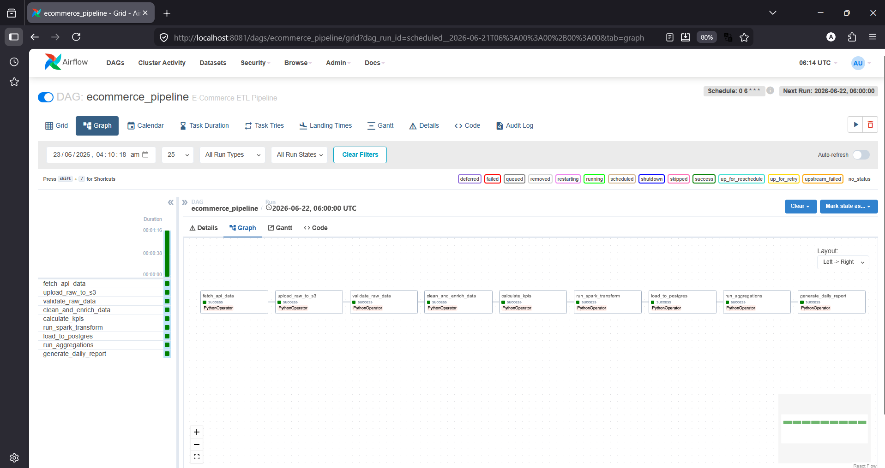
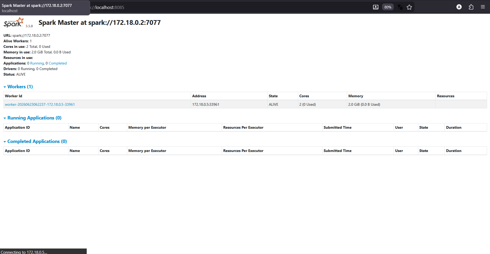
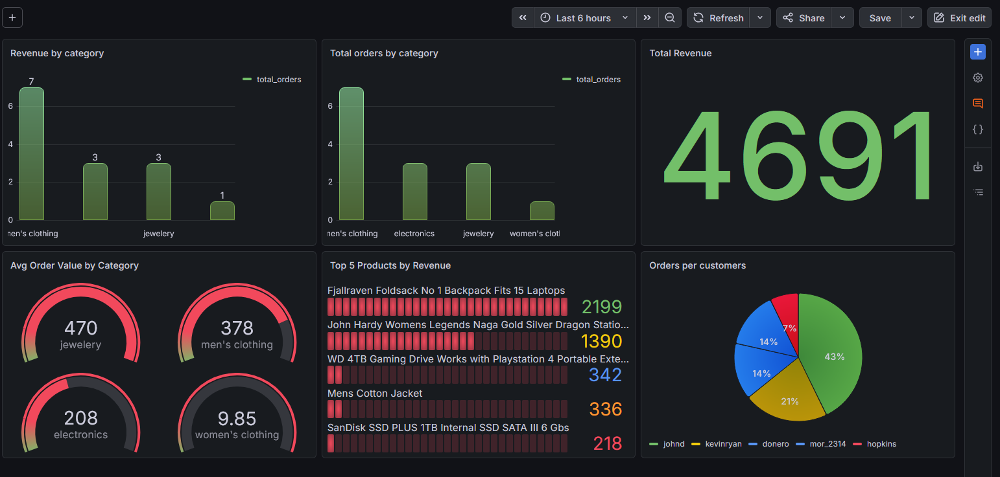
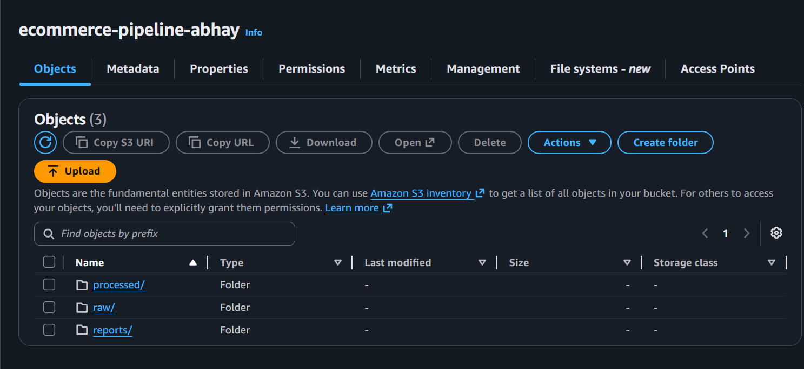
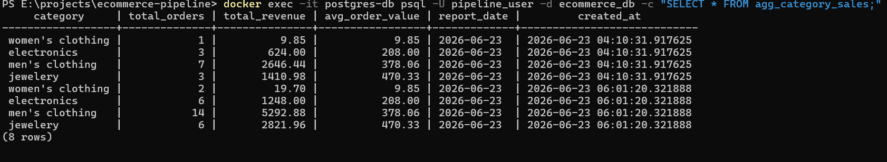

# E-Commerce Data Pipeline

A complete data engineering project where I built an end-to-end pipeline that automatically fetches e-commerce data, processes it, stores it on AWS, and monitors everything — all running inside Docker.

---

## What this project does

When the Docker containers are running, Airflow schedules this pipeline daily at 6AM. In production this would run on a cloud server 24/7:
1. Fetches live data from the Fake Store API (products, users, orders)
2. Validates and cleans the data using Python
3. Calculates KPIs like total revenue, top categories, units sold
4. Transforms everything using Apache Spark and saves as Parquet files on AWS S3
5. Loads the processed data into PostgreSQL with a proper star schema
6. Generates a daily JSON report and uploads it to S3
7. n8n checks the pipeline status and sends a notification

---

## Tech Stack

I used these tools to build this project:

- **Python** — for data fetching, cleaning, and KPI calculation
- **Apache Airflow** — to schedule and orchestrate the entire pipeline
- **Apache Spark (PySpark)** — for large scale data transformation
- **AWS S3** — as a data lake to store raw and processed files
- **PostgreSQL** — as a data warehouse with star schema design
- **Docker** — everything runs in containers, no manual setup needed
- **Grafana** — for monitoring and visualizing pipeline data
- **n8n** — for workflow automation and pipeline status notifications

---

## Pipeline Steps

The Airflow DAG has 9 tasks that run in sequence:

| Step | Task | What it does |
|------|------|-------------|
| 1 | fetch_api_data | Fetches products, carts, users from API |
| 2 | upload_raw_to_s3 | Saves raw JSON files to S3 |
| 3 | validate_raw_data | Checks for nulls and missing data |
| 4 | clean_and_enrich_data | Cleans data, adds price buckets |
| 5 | calculate_kpis | Revenue, top category, units sold |
| 6 | run_spark_transform | PySpark transforms → Parquet on S3 |
| 7 | load_to_postgres | Loads into star schema tables |
| 8 | run_aggregations | SQL aggregations into summary table |
| 9 | generate_daily_report | JSON report uploaded to S3 |

---

## Database Design

I designed a simple star schema in PostgreSQL:

dim_products ──┐
├──▶ fact_orders
dim_users ──┘

agg_category_sales (daily summary)


- **dim_products** — product details, categories, price buckets
- **dim_users** — user info, city, email
- **fact_orders** — all order transactions with amounts
- **agg_category_sales** — aggregated revenue by category per day

---

## n8n Automation

I added n8n to automatically monitor the pipeline every day:

Schedule Trigger → Check Airflow API → If pipeline ran → Log status


This runs daily and checks whether the Airflow DAG executed successfully.

---

## AWS S3 Structure

s3://ecommerce-pipeline-abhay/
├── raw/
│ ├── products.json
│ ├── carts.json
│ └── users.json
├── processed/
│ ├── products/*.parquet
│ └── kpis/kpis.json
└── reports/
└── 2026/06/23/daily_report.json


---

## Screenshots

### Airflow DAG


### Spark UI


### Grafana Dashboard


### n8n Workflow


### AWS S3 Bucket


### PostgreSQL Tables


---

## How to run this project

### Requirements
- Docker Desktop installed and running
- AWS account with S3 access
- Python 3.8+

### Steps

Clone the repo:
```bash
git clone https://github.com/abhay2470/E-commerce-data-pipeline.git
cd E-commerce-data-pipeline
```

Add your AWS credentials in `.env` file:

AWS_ACCESS_KEY_ID=your_key
AWS_SECRET_ACCESS_KEY=your_secret
AWS_DEFAULT_REGION=us-east-1


Start everything with one command:
```bash
docker compose up -d
```

Open Airflow and trigger the pipeline:

http://localhost:8081
Username: admin
Password: admin


Check monitoring:

Grafana → http://localhost:3000
n8n → http://localhost:5678
Spark UI → http://localhost:8085


---

## Results

- Ingested 20 products, 10 users, 14 orders from a live API
- Stored raw and processed data on AWS S3 as Parquet files
- Built a star schema with 4 tables in PostgreSQL
- Automated daily pipeline running at 6AM via Airflow
- Added n8n workflow to monitor pipeline status automatically
- Built Grafana dashboard to visualize revenue and orders

---

## About me

I built this project to learn and practice real data engineering workflows. It covers the full pipeline from ingestion to visualization using industry standard tools.

**Abhay**
- GitHub: [github.com/abhay2470](https://github.com/abhay2470)
- LinkedIn: [https://www.linkedin.com/in/abhay-kumar-4a623a3a4]